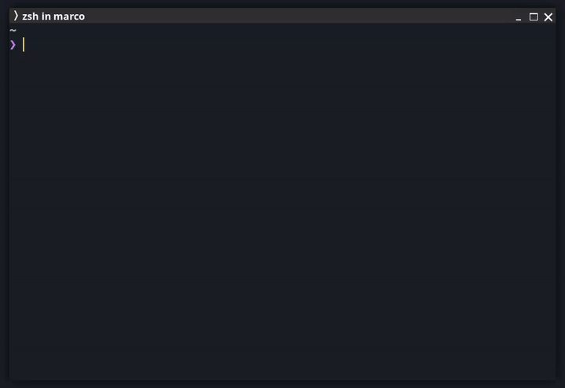

<div align="center">


# zana-client

[](https://github.com/mistweaverco/zana-client/graphs/contributors)
[](https://golang.org/)
[](https://github.com/mistweaverco/zana-client/releases/latest)
[](https://getzana.net/discord)

[Requirements](#requirements) • [Install](#install) • [Usage](#usage) • [What's working?](#whats-working)

<p></p>



<p></p>

Zana 📦 aims to be like Mason.nvim 🧱,
but with the goal of supporting 🌈 not only Neovim,
but rather any other editor 🫶.

Zana is swahili for "tools" or "tooling".

A minimal package manager for Neovim (and other editors) which
uses the [Zana Registry][zana-registry] to install and manage packages.

Easily install and manage LSP servers, DAP servers, linters, and formatters.

<p></p>

Currently, Zana is in pre-alpha and under active development.

<p></p>

</div>

## Requirements

Zana is a TUI, therefore you need to have a terminal emulator available.

Besides that, we shell out to `npm`, `pip`, `cargo`, `go`, and `git` to install packages,
depending on the package type.

E.g. if you want to install `pkg:npm` packages, you need to have `npm` installed.

For the packages to work in Neovim, you need to
[Zana.nvim](https://github.com/mistweaverco/zana.nvim) installed.

## Install

Just head over to the [download page][download-page] or
grab it directtly from the [releases][releases-page].

## Usage

The heart of Zana is its `zana-lock.json` file.
This file is used to keep track of the installed packages and their versions.

You can tell Zana where to find the `zana-lock.json` and
the packages by setting the environment variable `ZANA_HOME`.

If `ZANA_HOME` is not set,
Zana will look for the `zana-lock.json` file in the default locations:

- Linux: `$XDG_CONFIG_HOME/zana/zana-lock.json` or `$HOME/.config/zana/zana-lock.json`
- macOS: `$HOME/Library/Application Support/zana/zana-lock.json`
- Windows: `%APPDATA%\zana\zana-lock.json`

If the file does not exist,
Zana will create it for you (when you install a package).

1. Start Zana by running `zana` in your terminal.
2. Use the arrow keys (or hjkl) to navigate the packages.
3. Use `enter` to install a package.
4. Use `enter` to update a package.
5. Use `backspace` to remove a package.
6. Use `/` to filter packages.
7. Use `q` to quit Zana.

It's advised to keep the `zana-lock.json` file in version control.

### Modify environment path

If you want the installed packages to be available in your path,
you can add the following to your shell configuration file:

```sh
# For bash/zsh (add to ~/.bashrc or ~/.zshrc)
source <(zana env)

# For zsh with evalcache - https://github.com/mroth/evalcache
_evalcache zana env zsh
```

```sh
# For PowerShell (add to profile)
zana env powershell | Invoke-Expression
```

```sh
# Manual setup
eval "$(zana env)"
```

### CLI autocompletion

If you want autocompletion for the CLI commands,
you can add the following to your shell configuration file:

```sh
# For bash/zsh (add to ~/.bashrc or ~/.zshrc)
source <(zana completion bash)
# For zsh (add to ~/.zshrc)
source <(zana completion zsh)
# For zsh with evalcache - https://github.com/mroth/evalcache
_evalcache zana completion zsh
# For fish (add to ~/.config/fish/completions/zana.fish)
zana completion fish > ~/.config/fish/completions/zana.fish
# For PowerShell (add to profile)
zana completion powershell | Invoke-Expression
```

### CLI Options

You can run `zana --help` to see the available CLI options.

- install/add: Install packages (e.g., `zana install pkg:npm/@mistweavercokulala-ls@0.1.0 pkg:pypi/black pkg:golang/golangci-lint`)
- list/ls: Lists all installed packages (or with `--all`/`-A` flag all available packages.
- update/up: Update packages (e.g., `zana update pkg:npm/@mistweaverco/kulala-ls pkg:pypi/black@latest`)
- remove/rm/delete: Remove packages (e.g., `zana remove pkg:npm/@mistweaverco/kulala-ls pkg:pypi/black pkg:golang/golangci-lint`)

The `update` command accepts the an optional `--all`/`-A` flag to update all packages.

- health: Checks for requirements (for shelling out to install packages)

### Where are the packages?

Zana uses a basepath to install packages of different types.

If you have set the `ZANA_HOME` environment variable,
the basepath will be `$ZANA_HOME/packages`.

If `ZANA_HOME` isn't set, the basepath is:

- Linux: `$XDG_CONFIG_HOME/zana/packages` or `$HOME/.config/zana/packages`
- macOS: `$HOME/Library/Application Support/zana/packages`
- Windows: `%APPDATA%\zana\packages`

The packages are installed in the following directories:

- `pkg:npm`: `$basepath/npm`
- `pkg:pypi`: `$basepath/pypi`
- `pkg:github`: `$basepath/github`
- `pkg:golang`: `$basepath/golang`
- `pkg:cargo`: `$basepath/cargo`

## What's working?

- [x] [registry](https://github.com/mistweaverco/zana-registry) updates on startup
- [x] Updates available for installed packages?
- [x] Filtering packages
- [x] Vim keymaps
- [x] Install `pkg:npm` packages
- [x] Update `pkg:npm` packages
- [x] Remove `pkg:npm` packages
- [ ] Install `pkg:github` packages
- [ ] Update `pkg:github` packages
- [ ] Remove `pkg:github` packages
- [x] Install `pkg:pypi` packages
- [x] Update `pkg:pypi` packages
- [x] Remove `pkg:pypi` packages
- [x] Install `pkg:golang` packages
- [x] Update `pkg:golang` packages
- [x] Remove `pkg:golang` packages
- [x] Install `pkg:cargo` packages
- [x] Update `pkg:cargo` packages
- [x] Remove `pkg:cargo` packages


[download-page]: https://getzana.net/#download
[releases-page]: https://github.com/mistweaverco/zana-client/releases/latest
[zana-registry]: https://github.com/mistweaverco/zana-registry

