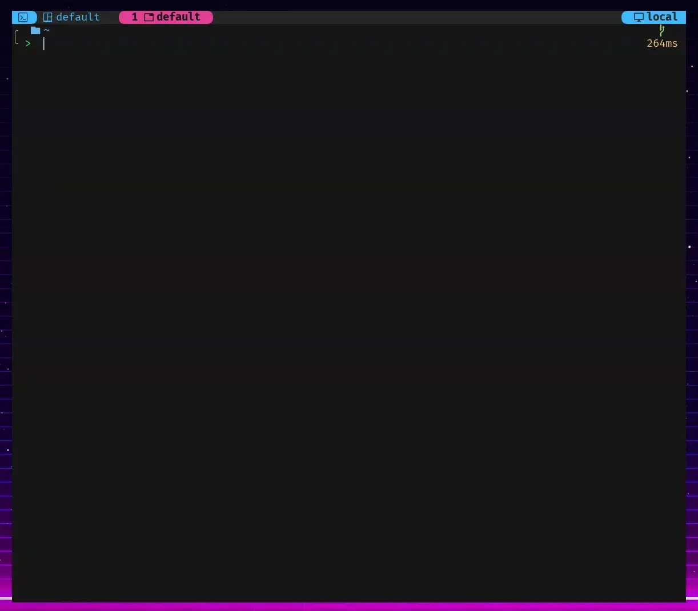

<div align="center">

![Zana logo][logo]

# zana-client

[![Made with love][badge-made-with-love]][contributors]
[![Go][badge-golang]][golang-website]
[![Development status][badge-development-status]][development-status]
[![Discord][badge-discord]][discord]
[![IRC][badge-irc]][irc]
[![Our manifesto][badge-our-manifesto]][our-manifesto]
[![Latest release][badge-latest-release]][latest-release]

[Terms used](#requirements) •
[Requirements](#requirements) •
[Install](#install) •
[Usage](#usage) •
[Supported providers](#supported-providers)

<p></p>



<p></p>

Zana 🌈 aims to be an editor-agnostic 🫶 package manager 📦 for
Tree-sitter parsers, LSP servers, DAP servers,
linters and formatters and more.

Zana is [swahili] for "tools" or "tooling."

<p></p>

</div>

## Terms used

- *Tree-sitter*: A parser generator tool and an incremental parsing library.
- *Language Server Protocol* (LSP): A protocol that defines
  how code editors and IDEs communicate with language servers.
- *Debug Adapter Protocol* (DAP): A protocol that defines
  how code editors and IDEs communicate with debuggers.
- *Package*: A package is a LSP server, DAP server, formatter
  or linter that can be installed via Zana.
- *Provider*: A provider is a package source,
    e.g., `npm`, `pypi`, `golang`, etc.
- *Package ID*: A package ID is a unique identifier for a package,
    e.g., `npm:@mistweavercokulala-ls@0.1.0`.
- *Zana Registry*: The Zana Registry is a registry of
    available packages that can be installed via Zana.
- *Terminal User Interface* (TUI): A text-based user interface
  that runs in a terminal emulator.

> [!NOTE]
> The zana client defaults to the [Zana Registry][zana-registry] to
> install and manage packages.
> This can be configured to use other registries as well.
> The client then merges all registries together and
> deduplicates the packages by their package ID.

## Requirements

Zana is a CLI, therefore you need to have a terminal emulator available.

Besides that, we shell out a lot to install packages.

E.g. if you want to install `npm` packages,
you need to have `npm` installed.

For the packages to work in Neovim, you either need to
[zana.nvim] installed,
or source the environment setup in your shell.

```sh
source <(zana env)
```

## Install

Just head over to the [download page][download-website] or
grab it directtly from the [releases][latest-release].

## Usage

The heart of Zana is its `zana-lock.json` file.
This file is used to keep track of the installed packages and their versions.

You can tell Zana where to find the `zana-lock.json` (and optional `config.yaml`)
by setting the environment variable `ZANA_HOME`.

If `ZANA_HOME` isn't set,
Zana will look for the `zana-lock.json` file in the default locations:

- Linux: `$XDG_CONFIG_HOME/zana/zana-lock.json` or
  `$HOME/.config/zana/zana-lock.json`
- macOS: `$HOME/Library/Application Support/zana/zana-lock.json`
- Windows: `%APPDATA%\zana\zana-lock.json`

If the file doesn't exist,
Zana will create it for you (when you install a package).

Zana's cache directory is controlled separately via `ZANA_CACHE`.
If `ZANA_CACHE` isn't set, Zana uses OS defaults:

```
- Linux: `~/.cache/zana`
- macOS: `~/Library/Caches/zana`
- Windows: `%LOCALAPPDATA%\zana\cache`
```

It's advised to keep the `zana-lock.json` file in version control.

### Modify environment path

If you want the installed packages to be available in your path,
you can add the following to your shell configuration file:

#### bash environment setup

add to `~/.bashrc`:

```sh
source <(zana env)
```

#### zsh environment setup

add to `~/.zshrc`:

```sh
source <(zana env zsh)
```

or with [evalcache](https://github.com/mroth/evalcache) for zsh,
add to `~/.zshrc`:

```sh
_evalcache zana env zsh
```

#### PowerShell environment setup

add to `profile`:

```sh
zana env powershell | Invoke-Expression
```

### CLI autocompletion

If you want autocompletion for the CLI commands,
you can add the following to your shell configuration file:

#### bash autocompletion setup

add to `~/.bashrc`:

```sh
source <(zana completion bash)
```

#### zsh autocompletion setup

add to `~/.zshrc`:

```sh
source <(zana completion zsh)
```

#### fish autocompletion setup

add to `~/.config/fish/completions/zana.fish`:

```sh
zana completion fish > ~/.config/fish/completions/zana.fish
```

#### powershell autocompletion setup

add to `profile`:

```sh
zana completion powershell | Invoke-Expression
```

### CLI Options

You can run `zana --help` to see the available CLI options.

#### zana show

`show/info/details` shows information about one or more packages.

```sh
zana show \
  npm:@mistweavercokulala-ls@0.1.0 \
  pypi:black \
  golang:golangci-lint
```

#### zana install

`install`/`add` install packages

```sh
zana install \
  npm:@mistweavercokulala-ls@0.1.0 \
  pypi:black \
  golang:golangci-lint
```

#### zana sync

`sync` syncs the installed packages or registry data.

For packages,
it'll make sure exactly the same packages are installed
that are listed in the `zana-lock.json` file.

```sh
zana sync packages
```

For registry data,
it'll update the local registry cache
with the latest data from the Zana Registry.

```sh
zana sync registry
```

The registry data is cached locally,
but with the `sync registry` command you can force an update.

You can control how long `zana` considers the downloaded registry zip "fresh":

- via `config.yaml` (recommended)

The optional `config.yaml` lives next to `zana-lock.json` in your Zana config dir
(usually `~/.config/zana/config.yaml`, or `$ZANA_HOME/config.yaml`).

Example:

```yaml
# yaml-language-server: $schema=https://getzana.net/client-config.schema.json
paths:
  cacheDir: ~/.cache/zana
registry:
  cacheMaxAge: 6h
  urls:
    - https://github.com/mistweaverco/zana-registry/releases/latest/download/zana-registry.json.zip
ui:
  color: auto
  output: rich
```

A JSON Schema is provided at `schemas/config.schema.json`.

#### zana list

`list`/`ls` list all installed packages.

```sh
zana list
```

or with `--all`/`-A` flag all available packages.

```sh
zana list --all
```

You can also filter packages by
prefix of either the package id or name.

```sh
 # lists all available packages with "yaml" in the name
zana list -A yaml
```

#### zana update

`update`/`up` updates packages.

```sh
zana update \
  npm:@mistweavercokulala-ls \
  pypi:black@latest
```

You can also update all packages at once with the `--all`/`-A` flag.

```sh
zana update --all
```

or filter packages by
prefix of either the package id or name.

```sh
 # updates all installed packages with "yaml" in the name
zana update -A yaml
```

Zana can also update itself with:

```sh
zana update --self
```

#### zana remove

`remove`/`rm` removes packages.

```sh
zana remove \
  npm:@mistweavercokulala-ls \
  pypi:black
```

or filter packages by
prefix of either the package id or name.

```sh
 # removes all installed packages with "yaml" in the name
zana remove -A yaml
```

#### zana health

- `health` checks for requirements
(for shelling out to install packages)

```sh
zana health
```

### Where are the packages?

Zana uses a basepath to install packages of different types.

The basepath is:

- Linux: `$XDG_DATA_HOME/zana/packages` or `$HOME/.local/share/zana/packages`
- macOS: `$HOME/Library/Application Support/zana/packages`
- Windows: `%APPDATA%\zana\packages`

The packages are installed in the following directory structure:

```
$basepath/$provider/$package-name/
```

### Tree-sitter parsers for Neovim

Parsers are written to Neovim's data directory under:

```
<stdpath("data")>/site/parser/<language>.<so|dylib|dll>
```

Zana builds parsers from upstream source using the `tree-sitter` CLI when a
registry package declares `treesitter.build`.

By default, Zana only builds and caches the parser artifacts under:

```
<zana-data-share>/artifacts/treesitter/<package>/<version>/<language>.<so|dylib|dll>
```

To install built parsers into Neovim, use:

```sh
zana install --integrate neovim <package>
```

Zana resolves `<stdpath("data")>` by running Neovim headless when available
(`nvim --headless ...`). If `nvim` is not available, it falls back to common
defaults:

- Linux: `$XDG_DATA_HOME/nvim` or `~/.local/share/nvim`
- macOS: `~/Library/Application Support/nvim`
- Windows: `%LOCALAPPDATA%\\nvim-data`

## Supported providers

- `cargo`
- `codeberg`
- `composer`
- `gem`
- `generic` (shell commands)
- `github`
- `gitlab`
- `golang`
- `luarocks`
- `npm`
- `nuget`
- `opam`
- `openvsx`
- `pypi`


[logo]: assets/logo.svg
[badge-made-with-love]: assets/badge-made-with-love.svg
[badge-golang]: assets/badge-golang.svg
[badge-development-status]: assets/badge-development-status.svg
[badge-our-manifesto]: assets/badge-our-manifesto.svg
[badge-latest-release]: https://img.shields.io/github/v/release/mistweaverco/zana-client?style=for-the-badge
[badge-discord]: https://mistweaverco.com/assets/badges/discord.svg
[badge-irc]: https://mistweaverco.com/assets/badges/irc.svg
[discord]: https://mistweaverco.com/discord
[irc]: https://mistweaverco.com/irc
[our-manifesto]: https://mistweaverco.com/manifesto
[development-status]: https://github.com/orgs/mistweaverco/projects/5/views/1?filterQuery=repo%3Amistweaverco%2Fzana-client.nvim
[registry-website]: https://registry.getzana.net
[golang-website]: https://golang.org
[website]: https://getzana.net
[contributors]: https://github.com/mistweaverco/zana-client/graphs/contributors
[swahili]: https://en.wikipedia.org/wiki/Swahili_language
[latest-release]: https://github.com/mistweaverco/zana-client/releases/latest
[download-website]: https://getzana.net/#download
[zana-registry]: https://github.com/mistweaverco/zana-registry
[zana.nvim]: https://github.com/mistweaverco/zana-nvim
